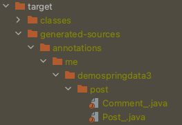

# [스프링 데이터 JPA 3 - 스프링 데이터 Common]
 

# Web 2부: DomainClassConverter
 

### * Converter
컨버터는 어떤 하나의 타입을 다른 타입으로 변환하는 인터페이스이다. 
그래서 아무 타입이나 다 변환할 수 있다. 
<pre>
Interface Converter❮S, T❯ 
    // (S(the source type)타입을 T(the target type)타입으로 변환)
</pre>
https://docs.spring.io/spring-framework/docs/current/javadoc-api/org/springframework/core/convert/converter/Converter.html
  

## DomainClassConverter
엔티티 타입을 아이디로도 변환하고, 아이디를 엔티티 타입으로 변환해주기도 한다.  
때문에 아래처럼 아이디를 파라미터로 받는 메소드를
<pre>
@GetMapping("/posts/{id}") // 원래 id는 문자열로 받지만
public String getPost(@PathVariable Long id) { // Long형으로 데이터바인더가 기본적으로 바인딩해준다.
    Optional❮Post❯ byId = postRepository.findById(id);
    Post post = byId.get();
    return post.getTitle();
}
</pre>
아래처럼 엔티티로 받아와도 DomainClassConverter가 변환해 준다. 
<pre>
@GetMapping("/posts/{id}")
public String getPost(@PathVariable("id") Post post) {
    return post.getTitle();
}
</pre>
  

### * Formatter
'어떠한 문자열을 어떠한 타입으로 바꿀 것인가.'  
Converter와 매우 비슷한데 다른 점은 Formatter는 문자열 기반이라는 것이다. 
<pre>
Interface Formatter❮T❯
    // (문자열을 T(the target type)타입으로 변환)
</pre>
아래와 같이 아이디를 파라미터로 받는 경우에는 아이디가 문자열이 아닐수도 있기 때문에 (현재 여기에서는 Long이다.) 
Formatter가 사용되지 않고, DomainClassConverter가 사용된다. 
<pre>
@GetMapping("/posts/{id}")
public String getPost(@PathVariable("id") Post post) {
    return post.getTitle();
}
</pre>
https://docs.spring.io/spring-framework/docs/current/javadoc-api/org/springframework/format/Formatter.html
    

# Web 3부: Pageable과 Sort
 

### * 스프링 MVC HandlerMethodArgumentResolver
스프링 MVC 핸들러 메소드의 매개변수로 받을 수 있는 객체를 확장하고 싶을 때 사용하는 인터페이스. 
https://docs.spring.io/spring-framework/docs/current/javadoc-api/org/springframework/web/method/support/HandlerMethodArgumentResolver.html  
여기에 나와있는 구현체들을 모두 사용할 수 있다. (abstract 빼고)  
여기에 추가로 스프링 데이터 JPA의 웹 기능을 사용하면 Pageable과 Sort를 사용할 수도 있다.  
(주로 Pageable을 사용하고 Sort는 거의 사용하지 않는다. Sort만 사용하게 되면 모든 내용을 가져와서 소팅만 하기 때문..)
    

# Web 4부: HATEOAS
HATEOAS 의존성을 추가해 준다. 
<pre>
❮dependency❯
    ❮groupId❯org.springframework.boot❮/groupId❯
    ❮artifactId❯spring-boot-starter-hateoas❮/artifactId❯
❮/dependency❯
</pre>
그리고 아래와 같이 PagedResourcesAssembler를 받도록 해준다. 
<pre>
/**
 * HATEOAS를 사용할 경우. (HATEOAS 의존성을 추가한 경우.)
 */
@GetMapping("/posts")
public PagedModel❮EntityModel❮Post❯❯ getPosts(Pageable pageable, PagedResourcesAssembler❮Post❯ assembler) {
    Page❮Post❯ all = postRepository.findAll(pageable);
    return assembler.toModel(all);
}
</pre>  
테스트를 하면 응답이 아래와 같이 나온다. 
<pre>
{
  "_embedded": {
    "postList": [
      {
        "id": 90,
        "title": "jpa",
        "created": null
      },
      {
        "id": 92,
        "title": "jpa",
        "created": null
      },
      {
        "id": 96,
        "title": "jpa",
        "created": null
      },
      {
        "id": 97,
        "title": "jpa",
        "created": null
      },
      {
        "id": 98,
        "title": "jpa",
        "created": null
      },
      {
        "id": 99,
        "title": "jpa",
        "created": null
      },
      {
        "id": 100,
        "title": "jpa",
        "created": null
      },
      {
        "id": 89,
        "title": "jpa",
        "created": null
      },
      {
        "id": 78,
        "title": "jpa",
        "created": null
      },
      {
        "id": 81,
        "title": "jpa",
        "created": null
      }
    ]
  },
  "_links": {
    "first": {
      "href": "http://localhost/posts/?page=0&size=10&sort=created,desc&sort=title,asc"
    },
    "prev": {
      "href": "http://localhost/posts/?page=2&size=10&sort=created,desc&sort=title,asc"
    },
    "self": {
      "href": "http://localhost/posts/?page=3&size=10&sort=created,desc&sort=title,asc"
    },
    "next": {
      "href": "http://localhost/posts/?page=4&size=10&sort=created,desc&sort=title,asc"
    },
    "last": {
      "href": "http://localhost/posts/?page=9&size=10&sort=created,desc&sort=title,asc"
    }
  },
  "page": {
    "size": 10,
    "totalElements": 100,
    "totalPages": 10,
    "number": 3
  }
}
</pre> 
아래와 같이 HATEOAS를 사용하지 않을 경우에는
<pre>
/**
 * HATEOAS를 사용하지 않을 경우. 
 */
@GetMapping("/posts")
public Page❮Post❯ getPosts(Pageable pageable) {
    return postRepository.findAll(pageable);
}
</pre>
아래와 같이 JSON 결과가 다르게 나오는 것을 확인할 수 있다. 
<pre>
{
  "content": [
    {
      "id": 91,
      "title": "jpa",
      "created": null
    },
    {
      "id": 98,
      "title": "jpa",
      "created": null
    },
    {
      "id": 89,
      "title": "jpa",
      "created": null
    },
    {
      "id": 96,
      "title": "jpa",
      "created": null
    },
    {
      "id": 99,
      "title": "jpa",
      "created": null
    },
    {
      "id": 100,
      "title": "jpa",
      "created": null
    },
    {
      "id": 101,
      "title": "jpa",
      "created": null
    },
    {
      "id": 97,
      "title": "jpa",
      "created": null
    },
    {
      "id": 80,
      "title": "jpa",
      "created": null
    },
    {
      "id": 83,
      "title": "jpa",
      "created": null
    }
  ],
  "pageable": {
    "sort": {
      "unsorted": false,
      "sorted": true,
      "empty": false
    },
    "offset": 30,
    "pageNumber": 3,
    "pageSize": 10,
    "paged": true,
    "unpaged": false
  },
  "totalElements": 101,
  "totalPages": 11,
  "last": false,
  "numberOfElements": 10,
  "number": 3,
  "size": 10,
  "sort": {
    "unsorted": false,
    "sorted": true,
    "empty": false
  },
  "first": false,
  "empty": false
}
</pre>
    

# [스프링 데이터 JPA 3 - 스프링 데이터 JPA]
 

# JpaRepository 
 

### @EnableJpaRepositories
- 스프링 부트 사용할 때는 사용하지 않아도 자동 설정 됨.
- 스프링 부트 사용하지 않을 때는 @Configuration과 같이 사용.
 

### @Repository 애노테이션
@Repository이 이미 붙어있기 때문에 직접 붙이지 않아도 된다.  
구현체인 SimpleJpaRepository에 이미 붙어있기 때문..  
@Repository는 SQLException 또는 JPA 관련 예외를 스프링의 DataAccessException으로 변환 해준다. 
여러가지 모든 예외를 SQLException 하나로 발생시켜서 SQLException 안의 코드값을 확인하고  
실제로 어떤 에러인지 확인해야 하는 불편함이 있어서 
구체적으로 어떤 에러인지 알 수 있는 DataAccessException의 하위 클래스들 중 하나로 매핑해서 
클래스 이름만 봐도 알 수 있도록 만들었다. (그런데 JPA보다 하이버네이트가 발생시키는 예외가 좀 더 직관적..)
    

# JpaRepository.save() 메소드
새로운 객체일 경우에는 insert 쿼리, 새로운 객체가 아닐 경우에는 update 쿼리가 발생한다.
<pre>
@Test
void save() {
    Post post = new Post();
    post.setId(1l);
    post.setTitle("jpa");
    postRepository.save(post); // insert 쿼리 발생.

    Post postUpdate = new Post();
    postUpdate.setId(1l);
    postUpdate.setTitle("hibernate");
    postRepository.save(postUpdate); // update 쿼리 발생.

    List❮Post❯ all = postRepository.findAll();
    assertThat(all.size()).isEqualTo(1);
}
</pre>
SimpleJpaRepository 소스를 보면 새로운 객체(Transient 상태의 객체)일 경우에는 EntityManager.persist(),  
새로운 객체가 아닐 경우(Detached 상태의 객체)에는 EntityManager.merge()를 실행하는 것을 확인할 수 있다. 
- persist(): Transient 상태의 객체를 Persistent 상태로 변경한다.  
    (Transient 상태의 객체는 JPA와 하이버네이트 둘 다 이 객체에 대해서 모르는 상태이다. (이 객체의 아이디를 가지고 있지 않은 상태.)) 
- merge(): Detached 상태의 객체를 Persistent 상태로 변경한다.  
    (Detached 상태는 한번이라도 Persistent 상태가 되었었던 객체. (이 객체의 아이디를 가지고 있는 상태.))  
    merge()를 실행하더라도 데이터베이스에 해당 데이터가 없으면 insert()가 발생하기도 한다.  
<pre>
@Transactional
public ❮S extends T❯ S save(S entity) {
    Assert.notNull(entity, "Entity must not be null.");
    if (this.entityInformation.isNew(entity)) {
        this.em.persist(entity);
        return entity;
    } else {
        return this.em.merge(entity);
    }
}
</pre>

#### * Transient인지 Detached인지 어떻게 판단하는가?
- 엔티티의 @Id 프로퍼티를 찾는다.  
해당 프로퍼티가 null이면 Transient 상태로 판단하고, id가 null이 아니면 Detached 상태로 판단한다.
- 엔티티가 Persistable 인터페이스를 구현하고 있다면 isNew() 메소드에 위임한다.
- JpaRepositoryFactory를 상속받는 클래스를 만들고 getEntityInformation()을 오버라이딩해서  
자신이 원하는 판단 로직을 구현할 수도 있다. 
 

#### * EntityManager.persist()
persist() 메소드에 넘긴 그 엔티티 객체를 Persistent 상태로 변경한다.
 

#### * EntityManager.merge()
merge() 메소드에 넘긴 그 엔티티의 복사본을 만들고, 
그 복사본을 다시 Persistent 상태로 변경하고 그 복사본을 반환한다.
 

<pre>
@Test
void save() {
    Post post = new Post();
    post.setTitle("jpa");
    Post savedPost = postRepository.save(post);// persist() 호출, insert 쿼리 발생.
    // 위와 같이 save()는 영속화되어 있는 객체를 리턴해 준다.
    // persist()는 persist() 메소드에 넘긴 그 엔티티 객체를 Persistent 상태로 변경한다.

    assertThat(entityManager.contains(post)).isTrue(); // post도 영속화가 되고,
    assertThat(entityManager.contains(savedPost)).isTrue(); // savedPost도 영속화가 된다.
    assertThat(savedPost == post).isTrue(); // 여기에서는 post와 savedPost가 같다. 하지만 다른 경우도 있다. 

    Post postUpdate = new Post();
    postUpdate.setId(post.getId());
    postUpdate.setTitle("hibernate");
    Post updatedPost = postRepository.save(postUpdate);// merge() 호출, update 쿼리 발생.
    // merge()는 merge() 메소드에 넘긴 그 엔티티의 복사본을 만들고,
    // 그 복사본을 다시 Persistent 상태로 변경하고 그 복사본을 반환한다.

    assertThat(entityManager.contains(updatedPost)).isTrue(); // updatedPost는 영속화가 되고,
    assertThat(entityManager.contains(postUpdate)).isFalse(); // postUpdate는 영속화가 되지 않는다.
    assertThat(updatedPost == postUpdate).isFalse(); // updatedPost와 postUpdate는 같지 않다.
    
    // postUpdate.setTitle("good luck"); // 파라미터로 넘긴 postUpdate는 영속화 상태가 아니기 때문에 변경되지 않는다.
    updatedPost.setTitle("good luck"); // 반환 받은 updatedPost는 영속화 상태이기 때문에 변경된다.
    // 내가 명시적으로 update하라고 알려주지 않아도 jpa가 알아서 객체 상태를 감지하다가
    // 필요하다고 느낀 시점(여기서는 아래의 findAll()이다. '데이터를 가져오려고 하네? 빨리 싱크해야겠다.'
    // 이 시점에 위의 모든 변경 내용들이 반영되고 데이터를 가져온다.)에 디비에 반영이 된다. 

    List❮Post❯ all = postRepository.findAll();
    assertThat(all.size()).isEqualTo(1);
}
</pre>
위와 같이 파라미터로 넘긴 객체와 저장 후 반환 받은 객체는 다를 수 있다. 
때문에 실수를 줄이기 위해서는 무조건 반환 받은 객체를 사용하고 파라미터로 넘긴 객체는 더이상 사용하지 않는 것이 좋다. 
    

# 쿼리 메소드 
https://docs.spring.io/spring-data/jpa/docs/current/reference/html/#jpa.query-methods.query-creation
 

# 쿼리 메소드 Sort
<pre>
/**
 * Sort의 정렬옵션에 들어갈 수 있는 문자열은 반드시 엔티티의 프로퍼티이거나 alias이어야 한다.
 * 예를 들어, title은 Post 엔티티의 프로퍼티이므로 title로 정렬하는 것이 가능하다.
 * 그리고 아래처럼 p.title의 alias인 pTitle로도 정렬이 가능하다.
 * 프로퍼티 또는 alias가 아닌 경우에는 Sort로 사용할 수 없다. (예를 들어, 함수와 같은..)
 * 하지만 JpaSort.unsafe()를 사용하면 함수도 사용할 수 있다.
 */
@Query("SELECT p, p.title AS pTitle FROM Post AS p WHERE p.title = ?1")
List❮Post❯ findByTitle(String title, Sort sort);
</pre>
<pre>
@Test
void findByTitle() {
    savePost();
    
    // List❮Post❯ all = postRepository.findByTitle("Spring Data Jpa", Sort.by("title"));
    // List❮Post❯ all = postRepository.findByTitle("Spring Data Jpa", Sort.by("LENGTH(title)")); // (X) 함수는 사용할 수 없다.
    List❮Post❯ all = postRepository.findByTitle("Spring Data Jpa", JpaSort.unsafe("LENGTH(title)")); // (O) JpaSort.unsafe()를 사용하면 함수도 가능하다.

    assertThat(all.size()).isEqualTo(1);
}
</pre>
    

# Named Parameter와 SpEL
 

### Named Parameter
<pre>
/**
 * [ Named Parameter ]
 * @Query에서 참조하는 매개변수를 '?1', '?2' 이렇게 채번으로 참조하는게 아니라
 * 이름으로 ':title' 이렇게 참조할 수 있다.
 */
@Query("SELECT p, p.title AS pTitle FROM Post AS p WHERE p.title = :title") // Named Parameter
List❮Post❯ findByTitle(@Param("title") String title, Sort sort);
</pre> 

### SpEL (Spring Expression Language) 
스프링 표현 언어. 
<pre>
/**
 * [ SpEL ]
 * 엔티티 이름 대신에 '#{#entityName}'를 써도 된다.
 * 이곳은 Post에 대한 Repository이기 때문에 자동적으로 엔티티 이름을 Post로 인식한다.
 * 장점은 엔티티 이름이 변경되었을 때 Repository에 있는 모든 쿼리의 엔티티 이름을 변경하지 않아도 된다는 장점이 있다.
 */
@Query("SELECT p, p.title AS pTitle FROM #{#entityName} AS p WHERE p.title = :title") // Named Parameter
List❮Post❯ findByTitle(@Param("title") String title, Sort sort);
</pre>
SpEL에 대한 자세한 내용은 아래 URL 참조.  
https://docs.spring.io/spring-framework/docs/current/reference/html/core.html#expressions  
    

# Update 쿼리 메소드
주로 Persistent 상태의 객체를 관리하다가 이 객체 상태에 변화가 일어났고,  
이 변화를 DB에 싱크해야겠다라고 하는 시점에 flush()를 한다.  
flush()를 해서 객체 상태를 데이터베이스에 동기화 시킨다. 이때 보통 update 쿼리가 자동적으로 실행이 된다.  
때문에 우리가 직접 update 쿼리 메소드를 만들어서 사용해야 하는 경우는 거의 없다.  
꼭 정의해서 사용해야 할 때에는 직접 정의해서 사용할 수도 있다.  
**_하지만 추천하지 않는 방법이다._**  
굳이 만들려면 아래와 같이 update 쿼리 메소드를 만들 수 있다. 
<pre>
/**
 * [ update 쿼리 메소드 ]
 */
// @Modifying // 조회가 아닌 수정하는 쿼리임을 표시. update 쿼리를 만들 때 붙여줘야 한다.
@Modifying(clearAutomatically = true, flushAutomatically = true)
@Query("UPDATE Post p Set p.title = ?1 WHERE p.id = ?2")
int updateTitle(String title, Long id);
</pre>
<pre>
@Test
void updateTitle() {
    Post spring = savePost(); // Persistent 상태의 객체.
    String hibernate = "hibernate";
    int update = postRepository.updateTitle(hibernate, spring.getId()); // id를 가지고 title을 변경한다.
    assertThat(update).isEqualTo(1);

    // spring이 Persistent 상태이기 때문에 DB에서 조회하지 않고 JPA가 캐싱하고 있던 것을 그대로 가져온다.
    // 때문에 값이 변경되지 않은 상태 그대로이다.
    Optional❮Post❯ byId = postRepository.findById(spring.getId()); // select를 하지 않는다.
    assertThat(byId.get().getTitle()).isEqualTo(hibernate); // title은 여전히 'spring'이기 때문에 테스트가 깨진다.

    /**
     * update 쿼리 메소드에서
     * '@Modifying(clearAutomatically = true, flushAutomatically = true)'를 붙이면 테스트가 깨지지 않는다.
     *
     * [ clearAutomatically ]
     *  => update 쿼리를 실행한 이후에 Persistent context를 clear 해준다. (캐시를 비워준다. 때문에 이후에 조회할 때 DB에서 새로 읽어온다.)
     *
     * [ flushAutomatically ]
     *  => update 쿼리 실행 이전에 Persistent context를 flush 해준다.
     *
     * 하지만 이 방법을 추천하지는 않는다.
     * (이 방법으로 delete도 구현할 수 있기는 하다. 하지만 또 다른 문제가..)
     */
}
</pre> 

하지만 위와 같이 update 쿼리 메소드를 만들지 않고, 아래처럼 사용하는게 간단하기도 하고 권장하는 방법이다. 
<pre>
@Test
void updateTitle2() {
    Post spring = savePost();
    spring.setTitle("hibernate"); // update
    // findAll()하기 전에 DB에 싱크를 맞춰야 하므로 update 쿼리가 날아간다.

    List❮Post❯ all = postRepository.findAll();
    assertThat(all.get(0).getTitle()).isEqualTo("hibernate");
}
</pre>
    

# EntityGraph
Fetch 모드를 좀 더 유연하게 설정할 수 있는 기능을 제공한다.  
쿼리 메소드 마다 연관 관계의 Fetch 모드를 설정 할 수 있다.  
각각의 다른 쿼리 메소드 마다 다른 Fetch 모드 전략을 다르게 설정할 수 있다는 장점이 있다.  
<pre>
/**
 * @NamedEntityGraph
 *  => @Entity에서 재사용할 여러 엔티티 그룹을 정의할 때 사용.
 */
/*@NamedEntityGraph(name = "Comment.post",
        attributeNodes = @NamedAttributeNode("post"))*/
@Entity
public class Comment {
    // @ManyToOne(fetch = FetchType.EAGER) // @ManyToOne은 기본 Fetch 모드는 EAGER이다.
    @ManyToOne(fetch = FetchType.LAZY)
    private Post post;
    ...
}
</pre>
<pre>
public interface CommentRepository extends JpaRepository❮Comment, Long❯ {

    // @EntityGraph(value = "Comment.post") // Comment의 Post를 EAGER 모드로 가져오게 된다.
    @EntityGraph(attributePaths = "post") // @NamedEntityGraph로 이름 설정없이 이렇게 한줄로 사용해도 된다. 
    Optional❮Comment❯ getById(Long id);

}
</pre>
<pre>
@Test
void getComment() {
    ...
    commentRepository.getById(1l); // @EntityGraph를 사용했기 때문에 EAGER 모드로 가져온다.
    System.out.println("================================");
    commentRepository.findById(1l); // Fetch 모드를 LAZY로 설정했기 때문에 LAZY 모드로 가져온다.
}
</pre>
    

# Projection
엔티티의 일부 데이터만 가져오기. 
 

## 1. Closed 프로젝션 
특정 컬럼만 select 하는 것.  
예를 들어, 'SELECT c.id c.comment FROM Comment AS c'와 같이 Comment에서 id와 comment만 가져오는 것.
 

## 2. Open 프로젝션
다 가져온 다음에 그중에 조합을 해서 특정 컬럼에 대해 연산을 해서 보는 것. 
예를 들어, last_name과 first_name을 합쳐서 full_name으로 가져오는 것. 
 

## 3. Closed 프로젝션 + Open 프로젝션 (추천)
인터페이스의 default 메소드를 사용하여  
Closed 프로젝션의 장점(특정 컬럼만 select)과 Open 프로젝션의 장점(커스텀한 구현체를 만들어서 메소드를 추가)을  
다 사용할 수 있는 방법.
  

<pre>
/**
 * [ Projection ]
 * 인터페이스 버전. 클래스로 만들어도 되지만 인터페이스로 만들 때보다 코드가 더 많아진다.
 */
public interface CommentSummary {

    String getComment();

    int getUp();

    int getDown();

    /**
     * [ Open 프로젝션 ]
     * 여기서의 target은 Comment인데, target을 일단 가져와야 하므로
     * Open 프로젝션을 추가하게 되면 Comment 컬럼을 전부 select하게 된다.
     * 먼저 한정지어서 가져오는게 아니기 때문에 Closed가 아닌 Open 프로젝션이다.
     */
    /*@Value("#{target.up + ' ' + target.down}")
    String getVotes();*/

    /**
     * [ default 메소드를 사용하는 방법 (Closed 프로젝션 + Open 프로젝션) (추천) ]
     * Closed 프로젝션의 장점(특정 컬럼만 select)과 Open 프로젝션의 장점(커스텀한 구현체를 만들어서 메소드를 추가)을 다 사용할 수 있는 방법.
     */
    default String getVotes() {
        return getUp() + " " + getDown();
    }

}
</pre>
<pre>
public interface CommentRepository extends JpaRepository❮Comment, Long❯ {
    ...
    /**
     * [ Projection ]
     */
    // 프로젝션을 사용하지 않은 경우, 모든 Comment의 컬럼 데이터를 다 select해서 가져오게 된다.
    // List❮Comment❯ findByPost_Id(Long id);

    // Closed 프로젝션을 사용할 경우, CommentSummary에 있는 컬럼만 select해서 가져온다.
    // Closed 프로젝션 =❯ 딱 이거이거만 가져오겠다고 정의해두는 방식.
    // List❮CommentSummary❯ findByPost_Id(Long id);
    // List❮CommentOnly❯ findByPost_Id(Long id);

    /**
     * 프로젝션이 여러개일 경우 제네릭을 사용한다.
     * 파라미터로 프로젝션 타입을 받아서 해당 프로젝션 타입으로 반환할 수 있다.
     */
    ❮T❯ List❮T❯ findByPost_Id(Long id, Class❮T❯ type);
}
</pre>
<pre>
@Test
void getComment() {
    ...
    /**
     * 4. default 메소드를 사용하는 방법 (Closed 프로젝션 + Open 프로젝션) (추천)
     * Closed 프로젝션의 장점(특정 컬럼만 select)과 Open 프로젝션의 장점(커스텀한 구현체를 만들어서 메소드를 추가)을 다 사용할 수 있는 방법.
     */
    Post post = new Post();
    post.setTitle("jpa");
    Post savedPost = postRepository.save(post);
    
    Comment comment = new Comment();
    comment.setComment("Spring data jpa projection");
    comment.setPost(savedPost);
    comment.setUp(10);
    comment.setDown(1);
    commentRepository.save(comment);
    
    // commentRepository.findByPost_Id(savedPost.getId(), CommentSummary.class).forEach(c -> {
    commentRepository.findByPost_Id(savedPost.getId(), CommentOnly.class).forEach(c -> {
        System.out.println("================================");
        // System.out.println(c.getVotes());
        System.out.println(c.getComment());
    });
}
</pre>
    

# Specifications
에릭 에반스의 책 DDD에서 언급하는 Specification 개념을 차용한 것으로  
QueryDSL의 Predicate와 비슷하다.  
QueryDSL과 비슷하면서 세팅이 좀 번거롭고, 세팅을 하고나면 어떠한 조건절을 스펙으로 정의할 수 있다.  
예를 들어, Comment를 예로 들면 베스트 Comment를 하나의 스펙으로 정의하고,  
또 '좋아요'가 10개 이상인 Comment를 또 다른 하나의 스펙으로 정의하고, 
이 두 스펙을 조합해서 사용할 수도 있다. 
- 베스트 Comment이면서(and) '좋아요'가 10개 이상인 것.
- 베스트 Comment이거나(or) '좋아요'가 10개 이상인 것.

이런식으로 쿼리를 만들 수 있다.
 
먼저 'JPA Model Generator' 의존성을 추가하고 인텔리제이 환경설정도 설정해 준다. 
<pre>
❮!— [ JPA Model Generator ]
    타입 세이프(type safe)한 쿼리를 제공.
    보통 이렇게 타입 세이프한 쿼리를 제공하는 라이브러리들은
    엔티티 클래스 기반으로 코드 제너레이션을 해서
    그 프로퍼티들을 타입 세이프하게 쓸 수 있게 도와준다.

    인텔리제이의 'Preferences ❯ Annotation Processors' 에서
    Enable annotation processing도 체크되어 있어야 한다.
    그리고 Annotation Processors 에서 + 버튼을 누르고
    'org.hibernate.jpamodelgen.JPAMetaModelEntityProcessor'도 추가해 준다.
--❯
❮dependency❯
    ❮groupId❯org.hibernate❮/groupId❯
    ❮artifactId❯hibernate-jpamodelgen❮/artifactId❯
❮/dependency❯
</pre>
그리고 메이븐 Clean한 후 프로젝트를 빌드하면 애노테이션 프로세서가 동작하면서  
아래와 같이 'target/generated-sources' 밑에 엔티티를 가지고 생성한 클래스들이 만들어진다.   
 

패키징을 할 때에는 아래와 같이 메이븐 플러그인이 필요할 수도 있다.
<pre>
❮plugin❯
    ❮groupId❯org.bsc.maven❮/groupId❯
    ❮artifactId❯maven-processor-plugin❮/artifactId❯
    ❮version❯2.0.5❮/version❯
    ❮executions❯
        ❮execution❯
            ❮id❯process❮/id❯
            ❮goals❯
                ❮goal❯process❮/goal❯
            ❮/goals❯
            ❮phase❯generate-sources❮/phase❯
            ❮configuration❯
                ❮processors❯
❮processor❯org.hibernate.jpamodelgen.JPAMetaModelEntityProcessor❮/processor❯
                ❮/processors❯
            ❮/configuration❯
        ❮/execution❯
    ❮/executions❯
    ❮dependencies❯
        ❮dependency❯
            ❮groupId❯org.hibernate❮/groupId❯
            ❮artifactId❯hibernate-jpamodelgen❮/artifactId❯
            ❮version❯${hibernate.version}❮/version❯
        ❮/dependency❯
    ❮/dependencies❯
❮/plugin❯ 
</pre>
그리고 Repository에서 JpaSpecificationExecutor<T>를 상속 받도록 해준다. 
<pre>
public interface CommentRepository 
        extends JpaRepository❮Comment, Long❯, JpaSpecificationExecutor❮Comment❯ {
}
</pre>

이 예제에서는 스펙 2개를 만들었다.
<pre>
public class CommentSpecs {

    public static Specification❮Comment❯ isBest() {
        /*return new Specification❮Comment❯() {
            @Override
            public Predicate toPredicate(Root❮Comment❯ root,
                                         CriteriaQuery❮?❯ query,
                                         CriteriaBuilder builder) {
                return builder.isTrue(root.get(Comment_.best)); // Comment의 best 값이 true인지.
            }
        };*/
        return (Specification❮Comment❯) (root, query, builder) -❯ { // 람다식으로 표현.
            return builder.isTrue(root.get(Comment_.best)); // Comment의 best 값이 true인지.
        };
    }

    public static Specification❮Comment❯ isGood() {
        /*return new Specification❮Comment❯() {
            @Override
            public Predicate toPredicate(Root❮Comment❯ root,
                                         CriteriaQuery❮?❯ query,
                                         CriteriaBuilder builder) {
                return builder.greaterThanOrEqualTo(root.get(Comment_.up), 10); // Comment의 up 값이 10 이상인지.
            }
        };*/
        return (Specification❮Comment❯) (root, query, builder) -❯ { // 람다식으로 표현.
            return builder.greaterThanOrEqualTo(root.get(Comment_.up), 10); // Comment의 up 값이 10 이상인지.
        };
    }

}
</pre>
아래와 같이 테스트하여 어떤 쿼리가 날아가는지 확인한다.
<pre>
@Test
public void specs() {
    // commentRepository.findAll(CommentSpecs.isBest());
    /**
     * select
     *         comment0_.id as id1_0_,
     *         comment0_.best as best2_0_,
     *         comment0_.comment as comment3_0_,
     *         comment0_.down as down4_0_,
     *         comment0_.post_id as post_id6_0_,
     *         comment0_.up as up5_0_
     *     from
     *         comment comment0_
     *     where
     *         comment0_.best=1
     */

    // commentRepository.findAll(CommentSpecs.isBest().and(CommentSpecs.isGood()));
    /**
     * select
     *         comment0_.id as id1_0_,
     *         comment0_.best as best2_0_,
     *         comment0_.comment as comment3_0_,
     *         comment0_.down as down4_0_,
     *         comment0_.post_id as post_id6_0_,
     *         comment0_.up as up5_0_
     *     from
     *         comment comment0_
     *     where
     *         comment0_.best=1
     *         and comment0_.up❯=10
     */

    // commentRepository.findAll(CommentSpecs.isBest().or(CommentSpecs.isGood()));
    /**
     * select
     *         comment0_.id as id1_0_,
     *         comment0_.best as best2_0_,
     *         comment0_.comment as comment3_0_,
     *         comment0_.down as down4_0_,
     *         comment0_.post_id as post_id6_0_,
     *         comment0_.up as up5_0_
     *     from
     *         comment comment0_
     *     where
     *         comment0_.best=1
     *         or comment0_.up❯=10
     */

    Page❮Comment❯ page = commentRepository.findAll(isBest().or(isGood()), PageRequest.of(0, 10));
    /**
     * select
     *         comment0_.id as id1_0_,
     *         comment0_.best as best2_0_,
     *         comment0_.comment as comment3_0_,
     *         comment0_.down as down4_0_,
     *         comment0_.post_id as post_id6_0_,
     *         comment0_.up as up5_0_
     *     from
     *         comment comment0_
     *     where
     *         comment0_.best=1
     *         or comment0_.up❯=10 limit ?
     */
}
</pre>
    

# Query by Example
QBE는 필드 이름을 작성할 필요없이(작성해야 한다.) 단순한 인터페이스를 통해  
동적으로 쿼리를 만드는 기능을 제공하는 사용자 친화적인 쿼리 기술이다.(?)  
QueryDSL의 Predicate 이나 Specifications 보다 조건이 제한적이고 그다지 권장하지 않아서 지금은 생략.  
    

# 트랜잭션 
 

# @Transactional
- 스프링 데이터 JPA가 제공하는 Repository의 모든 메소드에는 기본적으로 @Transactional이 적용되어 있다.  
- 우리가 사용하는 JpaRepository의 구현체인 SimpleJpaRepository에  
'@Transactional(readOnly = true)'이 이미 적용이 되어 있다.  
- SimpleJpaRepository에는 readOnly가 없고 @Transactional만 붙어있는 메소드들도 있다.  
- @Transactional은 클래스, 인터페이스, 메소드에 사용할 수 있으며, 메소드에 가장 가까운 애노테이션이 우선 순위가 높다.  
- @Transactional은 RuntimeException과 Error가 발생하면 해당 트랜잭션을 롤백 시킨다.  
(checked exception은 롤백하지 않는다.) 
- 만약 checked exception에도 롤백을 하고 싶은 경우에는 @Transactional 옵션으로  
rollbackFor, rollbackForClassName을 줄 수 있다.  
- RuntimeException임에도 롤백을 하고 싶지 않은 경우에는 @Transactional 옵션으로  
noRollbackFor, noRollbackForClassName을 줄 수 있다.  
- @Transactional에는 timeout 옵션도 있다.  
- @Transactional에는 transactionManager를 설정할 수 있는 옵션도 있는데  
우리는 기본적으로 JpaTransactionManager를 사용한다.  
- 가급적이면 데이터를 변경하는 오퍼레이션이 없으면 readOnly(데이터를 읽기만 할 것인지에 대한 설정)로  
true로 주면 성능 최적화에 도움된다.  
(단, 특정 DB에서는 isolation 레벨이 READ_UNCOMMITED로 동작할 수도 있다.) 
- isolation은 여러개의 트랜잭션이 동시에 접근했을 때 어떻게 제어할 것인지를 설정하는 옵션이다.  
옵션값으로는 DEFAULT, READ_COMMITED, READ_UNCOMMITED, REPEATABLE_READ, SERIALIZABLE 이 있다.  
기본값은 DEFAULT로 데이터베이스의 기본값을 따른다. (DB마다 다 다르지만 보통 READ_COMMITED가 기본인 경우가 많다.) 
- isolation 성능 순서: READ_UNCOMMITED > READ_COMMITED > REPEATABLE_READ > SERIALIZABLE 
    - READ_UNCOMMITED: dirty reads, non-repeatable reads, phantom reads는 발생할 수 있음.  
    - READ_COMMITED: dirty reads 방지. non-repeatable reads, phantom reads는 발생할 수 있음.  
    - REPEATABLE_READ: dirty reads, non-repeatable reads 방지. phantom reads는 발생할 수 있음.  
    - SERIALIZABLE: 전부 방지. DB에 동시에 접근할 수 있는 트랜잭션이 하나뿐이기 때문에 가장 성능이 좋지 않다.  
    
    http://wiki.gurubee.net/pages/viewpage.action?pageId=21200923 
     
- propagation은 트랜잭션을 어떻게 전파시킬 것인지를 설정하는 옵션이다.  
트랜잭션으로 시작한 어떠한 메소드가 있는데 @Transactional을 가지고 있는 다른 메소드를 호출했을 때  
기존에 있던 트랜잭션을 이어갈 것인지 아니면 기존에 있던 트랜잭션을 쓰지 않고 새로운 트랜잭션을 만들어서 사용할 것인지를 설정.  
- @Transactional 애노테이션을 보통 Repository에 붙이거나,  
또는 여러 Repository를 사용하는 Service쪽에도 붙여서 사용한다.  
(여러 Repository를 사용하는 코드가 하나의 트랜잭션으로 처리가 되도록..)  

<pre>
/**
 * [ @Transactional ]
 * JPA 구현체로 Hibernate를 사용할 때 트랜잭션을 readOnly를 사용하면 좋은 점.
 *  => Flush 모드를 'NEVER'로 설정하여, Dirty checking을 하지 않도록 한다.
 *      - Flush 모드: 데이터베이스에 싱크를 하는 모드. 언제 데이터베이스에 싱크를 할 것인가.
 *          적절한 타이밍에 하게 되는데 보통은 커밋할 때, 또는 데이터를 read하기 전에 Flush를 한다.
 *          readOnly의 경우 데이터 변경이 일어나지 않기 때문에 Flush할 필요가 없다.
 *          그렇기 때문에 Persistent는 Dirty checking을 할 필요도 없다.
 *          (변경이 없으므로 변경을 감지해야 할 필요가 없는 것.)
 *          특히 데이터가 많은 경우에는 Dirty checking을 끄면 성능에 많은 도움이 된다.
 */
@Transactional(readOnly = true)
❮T❯ List❮T❯ findByPost_Id(Long id, Class❮T❯ type);
</pre>

https://docs.spring.io/spring-framework/docs/current/javadoc-api/org/springframework/transaction/annotation/Transactional.html  
    

# Auditing
    
